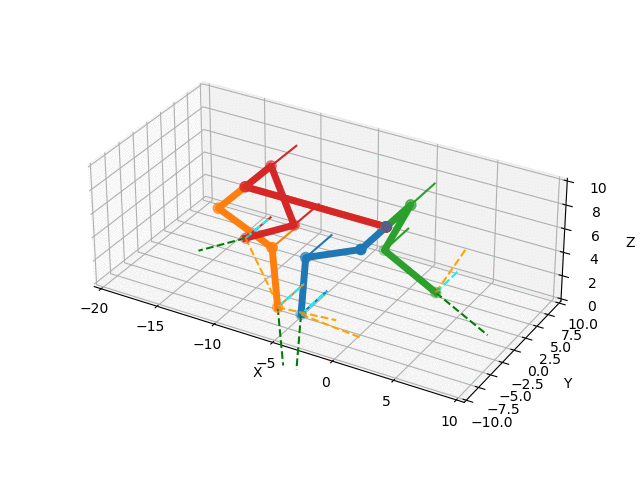
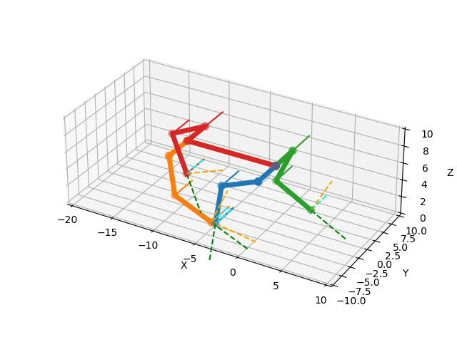

# Inverse Kinematic Model OpenCat

This is an inverse kinematic model and gait generator for the OpenCat project based on the IKPY library.

## Nybble-Version
 

## Bittle-Version

## Usage and Tweaks
For best results change the optimization algorithm in IKPY from "L-BFGS-B" to "SLSQP". 

"inverse_kinematics.py" line 134 from "L-BFGS-B" to e.g. "SLSQP".

res = scipy.optimize.minimize(optimize_total, chain.active_from_full(starting_nodes_angles), method='SLSQP', bounds=real_bounds, options=options)

